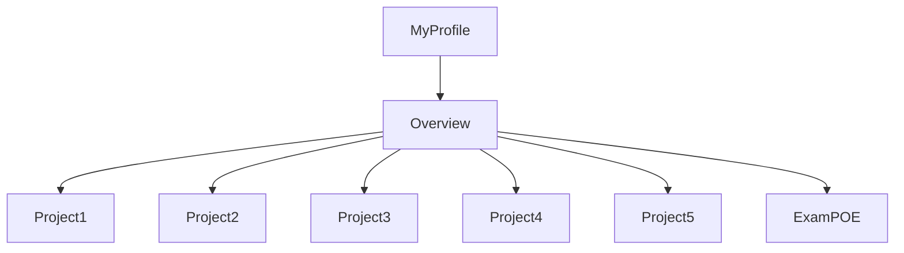
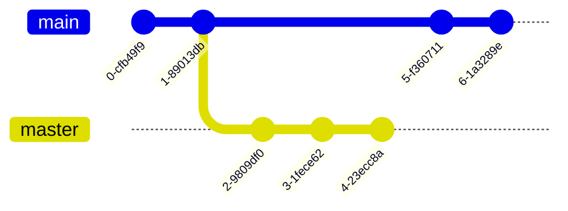

# CMPG-323-Overview---24361879
I created a repository called CMPG 323 - "student number".
Inside that respository I created milestones and labels which I will use in my various projects.
I will update the readme file with projects 2 through 5 as I complete them.

Below is a flow chart demonstrating the structure of my profile and this specific repository.

Below is a graph representing my branching strategy for the repository branches, main and master (which i'll use to feed 'ready to deploy code' into main)

The purpose of the .gitignore file is to ensure that certain files not tracked by Git, remain untracked.
If I was allowed to keep this repository private and give admin rights to trusted individuals, it would've ensured a greater level of protection of confidential information. The credentials will be stored in a json file as they'll be used in the connection string when setting up my database. The credentials in the connection string ensures reliable/up to date connection to the database.

Have a look at the "insights" form which contains two charts. I am only able to produc 2 charts even though 4 was requested. Take note, Burndown charts were not an option and that's why they're not in the overview repo. 

Changes have been made to this file which is now a mock source code file.
An Azure SQL Database was setup using the SQL code providede by our CMPG323 lecturers. A resource was created on Azure that contains the database and App Service as well
as App Service Plan. I had difficulty in setting up my Patch method in the various controllers. I kept on getting a 500 error. 500 errors are general errors that 
don't tell us a whole lot about what's going on. I populated my three controllers with the various GET, POST, DELETE and PUT methods. The PUT method was my own that I created
and it's also the only private method of the lot.

I did comment out my PATCH method so that the API can run. Can you please advise on the reason for the unstable PATCH method.

Furthermore, I scaffled the database and everything works smoothly, except for the Package Manager commands. I spent alot of time typing in that console. 
I used on resource to help me out in this regard but it was to no avail. The resource is: https://stackoverflow.com/

I published my VS to Azure and Cloned my GitHub Overview Repository.

I'm updating this READMe file in VS after cloning my Git repository.