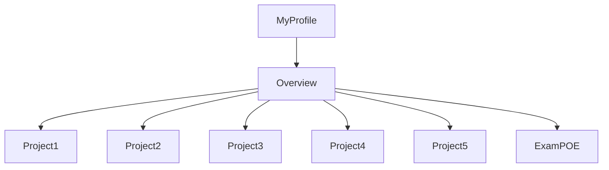

# CMPG-323-Overview---24361879
I created a repository called CMPG 323 - "student number".
Inside that respository I created milestones and labels which I will use in my various projects.
I will update the readme file with projects 2 through 5 as I complete them.

Below is a flow chart demonstrating the structure of my profile and this specific repository.

Below is a graph representing my branching strategy for the repository branches, main and master (which i'll use to feed 'ready to deploy code' into main)

The purpose of the .gitignore file is to ensure that certain files not tracked by Git, remain untracked.
If I was allowed to keep this repository private and give admin rights to trusted individuals, it would've ensured a greater level of protection of confidential information. The credentials will be stored in a json file as they'll be used in the connection string when setting up my database. The credentials in the connection string ensures reliable/up to date connection to the database.

Have a look at the "insights" form which contains two charts. I am only able to produc 2 charts even though 4 was requested. Take note, Burndown charts were not an option and that's why they're not in the overview repo. 

Changes have been made to this file which is now a mock source code file.
An Azure SQL Database was setup using the SQL code providede by our CMPG323 lecturers. A resource was created on Azure that contains the database and App Service as well
as App Service Plan. I had difficulty in setting up my Patch method in the various controllers. I kept on getting a 500 error. 500 errors are general errors that 
don't tell us a whole lot about what's going on. I populated my three controllers with the various GET, POST, DELETE and PUT methods. The PUT method was my own that I created
and it's also the only private method of the lot.

I did comment out my PATCH method so that the API can run. Can you please advise on the reason for the unstable PATCH method.

Furthermore, I scaffled the database and everything works smoothly, except for the Package Manager commands. I spent alot of time typing in that console. 
I used on resource to help me out in this regard but it was to no avail. The resource is: https://stackoverflow.com/

I published my VS to Azure and Cloned my GitHub Overview Repository.

I'm updating this READMe file in VS after cloning my Git repository.

What to Submit:
GitHub URL: 
https://github.com/DoreenGrad/CMPG-323-Overview---24361879

Credentials to connect to API: 
Server name: doreencmpg323
Server admin login: doreenserver
Password: adminDoreen1

URL to API:
https://portal.azure.com/#@nwucloud.onmicrosoft.com/resource/subscriptions/6dcf03fb-b58d-4ace-ab0a-496e4ea1f16c/resourceGroups/apim-rgProj2/overview

List of all endpoints:

doreencmpg323   SQL server  South Africa North
proj2db-dev (doreencmpg323/proj2db-dev) SQL database    South Africa North
Project2doreen-dev  App Service South Africa North
Project2doreenPlan-dev  App Service plan    South Africa North

Reference list:
https://www.geeksforgeeks.org/difference-between-put-and-patch-request/
https://stackoverflow.com/500-error

CMPG-323-Project-3---24361879
In project 3 we implemented pattern design. We had 3 tiers of difficulty to implement. I opted for tier 2 and while i understand what the code does and how it works, I did find trouble using Azure. It's difficult working with free services. There are constant road blocks that occur and they don't affect everyone.

I also had a glitch setting up my app services. It gave me an error but no error message. It said build successful and i can view my project on the rgCMPG323 resource group under the CMPG323 Subscription.

# CMPG-323-Project-4---24361879
RPA and Testting

WElcome to my Project 4 REadMe file.
The project started off with a bunch of training courses that prepared me for my work using automation and uipath.
I learnt about asset management in orchestrator.
I learnt how to publish from uipath studio into the cloud where my orchestrator is situated.

I have commited 6 times to github and published 5 times to my personal workspace in orchestrator.
THe project starts off by automating the username and password of a user whose login credentials are stored in assets.

uipath studio uses a secure string value to store the password and send the bLoginSuccess variable to be passed.

Login is successfull and you'll access the home page of the project. 

No work will need to be done and the zone page will start working. Zones data read from the provided csv will populate their relevant fields on the
webpage. It is able to do this because of an excel process I used. the process gets the range of the sheet it's working with and reads all the data within the range
to the relevant data tables in uipath. In my project the zone sheet in excel is read to the data table dtZone in uipath studio.

I then used a for each workflow to iterate through the rows of the zones sheet. It'll do this for my category sheet as well as my device sheet. 
Inside the for each i placed a navigate browser activity to open the relavant webpage and then I followed this up with a type into activity to enter the row data.
In order to distinguish between columns in a row a used a get activity to get the neccessary columns out of the csv file. I used the real column names in a string and
assigned a string variable to each column e.g "ZoneName" is represented by variable = zoneName.

AFter the webpag fields have been populated I click the create button and subsequently the record is created.

The process is the same for category sheet and in most part for the device sheet.
The only difference on the device data table is that it contains information from the previous two data tables i.e. dtZone and dtCategory.
When a the device data table is iterated over the zone and categroy data tables neeed to have been created in order for their data fields to show 
on the devices webpage.

Furthermore, Device has a check box which signifies whether or not the device is active and this box is checked on some data and not on others.
I used an "if then else" statement to check all instances that represent as TRUE in the csv file for that coloumn of data and unchecked for FALSE.

After each iteration of the device process i return back to the list so that when the process is done running that the user can view all the created devices items.
I then implement testing on two records i.e. D03 and D04 to test results. I then use a write cell activity inside the excel process to change the values of the cell to
TRUE if the process was created successfully and FALSE otherwise.

If you want to see it in action all you have to do is delete all the current entires on the website and then click run and the whole process will be run from
login to test results.

THis conlcudes my Project 4.

Below is a screenshot of my process in orchestrator.

Here is a screenshot of my login credentials that I stored in assets in my personal workspace in orchestrator.

