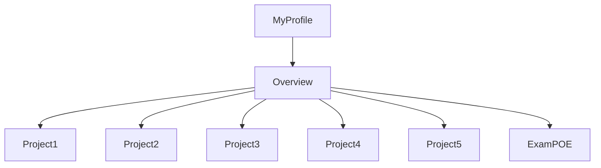
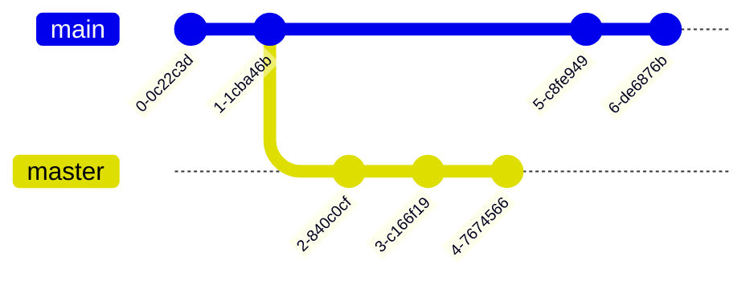

# CMPG-323-Overview---24361879
I created a repository called CMPG 323 - "student number".
Inside that respository I created milestones and labels which I will use in my various projects.
I will update the readme file with projects 2 through 5 as I complete them.

Below is a flow chart demonstrating the structure of my profile and this specific repository.

Below is a graph representing my branching strategy for the repository branches, main and master (which i'll use to feed 'ready to deploy code' into main)

The purpose of the .gitignore file is to ensure that certain files not tracked by Git, remain untracked.
If I was allowed to keep this repository private and give admin rights to trusted individuals, it would've ensured a greater level of protection of confidential information. The credentials will be stored in a json file as they'll be used in the connection string when setting up my database. The credentials in the connection string ensures reliable/up to date connection to the database.

Have a look at the "insights" form which contains two charts. I am only able to produc 2 charts even though 4 was requested. Take note, Burndown charts were not an option and that's why they're not in the overview repo. 

Changes have been made to this file which is now a mock source code file.
An Azure SQL Database was setup using the SQL code providede by our CMPG323 lecturers. A resource was created on Azure that contains the database and App Service as well
as App Service Plan. I had difficulty in setting up my Patch method in the various controllers. I kept on getting a 500 error. 500 errors are general errors that 
don't tell us a whole lot about what's going on. I populated my three controllers with the various GET, POST, DELETE and PUT methods. The PUT method was my own that I created
and it's also the only private method of the lot.

I did comment out my PATCH method so that the API can run. Can you please advise on the reason for the unstable PATCH method.

Furthermore, I scaffled the database and everything works smoothly, except for the Package Manager commands. I spent alot of time typing in that console. 
I used on resource to help me out in this regard but it was to no avail. The resource is: https://stackoverflow.com/

I published my VS to Azure and Cloned my GitHub Overview Repository.

I'm updating this READMe file in VS after cloning my Git repository.

What to Submit:
GitHub URL: 
https://github.com/DoreenGrad/CMPG-323-Overview---24361879

Credentials to connect to API: 
Server name: doreencmpg323
Server admin login: doreenserver
Password: adminDoreen1

URL to API:
https://portal.azure.com/#@nwucloud.onmicrosoft.com/resource/subscriptions/6dcf03fb-b58d-4ace-ab0a-496e4ea1f16c/resourceGroups/apim-rgProj2/overview

List of all endpoints:

doreencmpg323   SQL server  South Africa North
proj2db-dev (doreencmpg323/proj2db-dev) SQL database    South Africa North
Project2doreen-dev  App Service South Africa North
Project2doreenPlan-dev  App Service plan    South Africa North

Reference list:
https://www.geeksforgeeks.org/difference-between-put-and-patch-request/
https://stackoverflow.com/500-error

# CMPG-323-Project-3---24361879

In project 3 we implemented pattern design. We had 3 tiers of difficulty to implement.
I opted for tier 2 and while i understand what the code does and how it works, I did find trouble using 
Azure. It's difficult working with free services. There are constant road blocks that occur and they don't affect everyone.

I also had a glitch setting up my app services. It gave me an error but no error message. It said build successful and i can view my project on the rgCMPG323 
resource group under the CMPG323 Subscription.

# CMPG-323-Project-4---24361879
RPA and Testting

WElcome to my Project 4 REadMe file.
The project started off with a bunch of training courses that prepared me for my work using automation and uipath.
I learnt about asset management in orchestrator.
I learnt how to publish from uipath studio into the cloud where my orchestrator is situated.

I have commited 6 times to github and published 5 times to my personal workspace in orchestrator.
THe project starts off by automating the username and password of a user whose login credentials are stored in assets.

uipath studio uses a secure string value to store the password and send the bLoginSuccess variable to be passed.

Login is successfull and you'll access the home page of the project. 

No work will need to be done and the zone page will start working. Zones data read from the provided csv will populate their relevant fields on the
webpage. It is able to do this because of an excel process I used. the process gets the range of the sheet it's working with and reads all the data within the range
to the relevant data tables in uipath. In my project the zone sheet in excel is read to the data table dtZone in uipath studio.

I then used a for each workflow to iterate through the rows of the zones sheet. It'll do this for my category sheet as well as my device sheet. 
Inside the for each i placed a navigate browser activity to open the relavant webpage and then I followed this up with a type into activity to enter the row data.
In order to distinguish between columns in a row a used a get activity to get the neccessary columns out of the csv file. I used the real column names in a string and
assigned a string variable to each column e.g "ZoneName" is represented by variable = zoneName.

AFter the webpag fields have been populated I click the create button and subsequently the record is created.

The process is the same for category sheet and in most part for the device sheet.
The only difference on the device data table is that it contains information from the previous two data tables i.e. dtZone and dtCategory.
When a the device data table is iterated over the zone and categroy data tables neeed to have been created in order for their data fields to show 
on the devices webpage.

Furthermore, Device has a check box which signifies whether or not the device is active and this box is checked on some data and not on others.
I used an "if then else" statement to check all instances that represent as TRUE in the csv file for that coloumn of data and unchecked for FALSE.

After each iteration of the device process i return back to the list so that when the process is done running that the user can view all the created devices items.
I then implement testing on two records i.e. D03 and D04 to test results. I then use a write cell activity inside the excel process to change the values of the cell to
TRUE if the process was created successfully and FALSE otherwise.

If you want to see it in action all you have to do is delete all the current entires on the website and then click run and the whole process will be run from
login to test results.

THis conlcudes my Project 4.

Below is a screenshot of my process in orchestrator.

Here is a screenshot of my login credentials that I stored in assets in my personal workspace in orchestrator.

# CMPG-323-Project-5-24361879

Welcome to project 5. Monitoring and Reporting in power Bi. Version control like we did in project 4 is not possible with power bi and github.
I'll need to upload each iteration of the pbix file manually and then update my github readme file after each commit. 

I have made the first commit and it contains a pbix file. In the file there are two pages, Device Registration and Device Monitoring. Device Monitoring contains the following: 

I count the number of registered devices by their sub category ID and Zone ID in the two donut charts.
In the stacked column chart I compare the device status between inactive and active.
THese reports were requested in the rubric and indicate quantity of devices by device name.

On the Device Registration page I have the following:

Here I count sub category ID be device name in the stacked bar chart. And we have two time oriented reports. In the stacked column chart we count registered devices by their zone ID's and determine in which year they were installed/registered. The report at the top is fun to look at, here I used a timeline slicer, combined with a line chart. The timeline slicer works better when there are more datapoints but you can see the just of it here. It represents months, quarters and years...but can go down as far as days. It compares those three time dimensions to the line chart underneath which counts the number of registered device ID's by year.

Commit number 2. This commit contains the High Level Metrics page. Here I used tables and two line and clustered column charts. The visual looks cool but the high level metric come in with the week calculation to calculate the number of weeks in a year and then the weeknum measure that gets used as a tooltip to give important information when hovering over the charts. The week calculation makes use of DAX  to get the week in which a device was installed/registered or in this case the device ID by category ID and device ID by zone ID. The tables are used to represent the relationships between the entites'datasets in the model view and to show off the calculation of week and the measure weeknum which I used in the charts as a tooltip. I had to create relationshps in order to set up the visuals and tables metrics I provided in my report. I also had to transform the data in the csv file because the column headers were out of sorts and the naming of them was inconsistent. I also had to change the attributes of sub category and category because they seemed to be confused. I also removed category ID attribute from device entity and replaced it with sub category ID attribute. 

High level Metrics page:

Entity relationships/ datasets relationships on the model view:

Here I used the power query editor to transform the data from the csv file:

Here is an example of one of the changes made in power query editor. I had to replace category ID with sub category ID because the data didn't make sense the way
it was setup. 

Here is my week calculation:

Here is my weeknum measure which is also a calculation (average) and used as a tooltip in the charts.

Last but not least, I have published my report and dataset and the csv file that I used for my dataset onto power bi service. I have also published it from power bi
service to github in an attempt to do version control. Instead power bi service asked me to use a paid version of which I now have a 60 day free trial to do this. It
didn't turn out how I thought the instructions were instructing me, instead it created a github workbook on power bi service. I'll include the link in this readme so that you can check it out if you want. 

I have also added filters to this report which allows the user to filter any data they deem neccessary. I have include universal fiters for device name/ID, Zone ID 
category ID and timeline filtering. Below is a visual from my report representing this:

https://app.powerbi.com/groups/me/reports/0d74c190-a9c5-46b6-bb1c-2f6c9d88d5fb/ReportSection
https://app.powerbi.com/groups/051f33aa-11fd-4459-9988-a3c72f8a8b40/reports/c6bae9ed-570b-4d60-9676-c9cdc3100089/ReportSectione059d1f02f5978e9701f
https://app.powerbi.com/groups/051f33aa-11fd-4459-9988-a3c72f8a8b40/reports/2f32c605-bf8b-4cc2-90ea-5e43edc63327/ReportSection5

