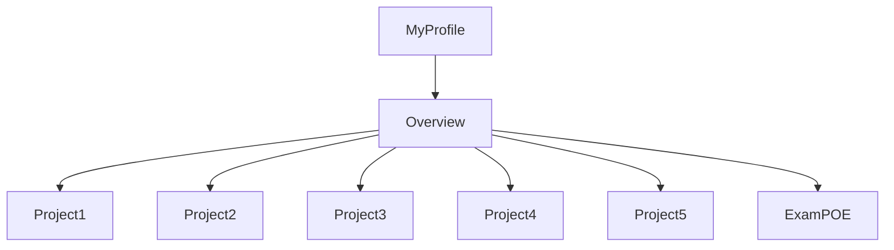
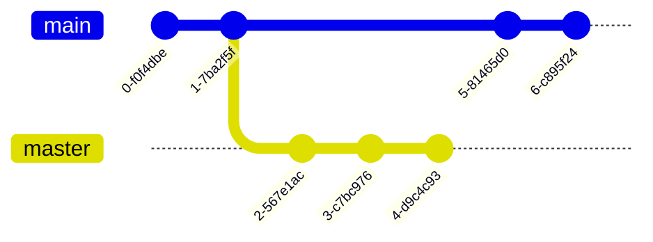

# CMPG-323-Overview---24361879
I created a repository called CMPG 323 - "student number".
Inside that respository I created milestones and labels which I will use in my various projects.
I will update the readme file with projects 2 through 5 as I complete them.

Below is a flow chart demonstrating the structure of my profile and this specific repository.

Below is a graph representing my branching strategy for the repository branches, main and master (which i'll use to feed 'ready to deploy code' into main)

The purpose of the .gitignore file is to ensure that certain files not tracked by Git, remain untracked.
If I was allowed to keep this repository private and give admin rights to trusted individuals, it would've ensured a greater level of protection of confidential information. The credentials will be stored in a json file as they'll be used in the connection string when setting up my database. The credentials in the connection string ensures reliable/up to date connection to the database.

Have a look at the "insights" form which contains two charts. I am only able to produc 2 charts even though 4 was requested. Take note, Burndown charts were not an option and that's why they're not in the overview repo. 
