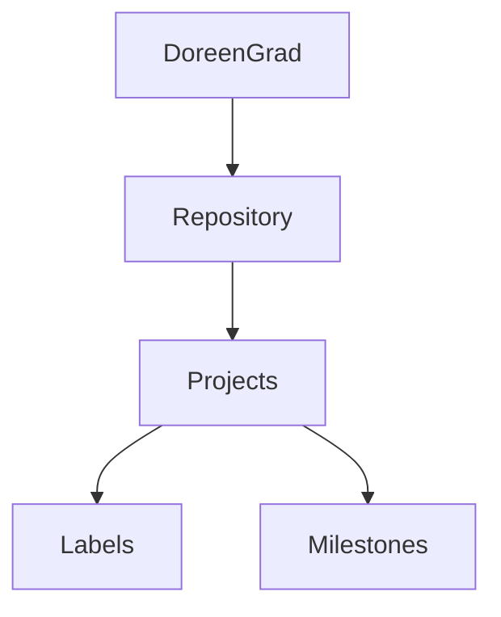

# CMPG-323-Overview---24361879
I created a repository called CMPG 323 - "student number".
Inside that respository I created milestones and labels which I will use in my various projects.
I will update the readme file with projects 2 through 5 as I complete them.

Below is a flow chart demonstrating the structure of my profile and this specific repository.

The purpose of the .gitignore file is to ensure that certain files not tracked by Git remain untracked.

This repository can only be accessed by trusted individuals. This ensures protection of confidential information.
